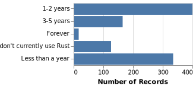
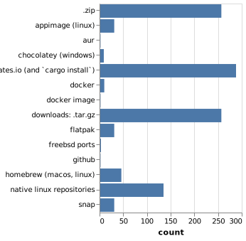

# Rust CLI Survey

Over the month of March 2018, we've been accepting responses to the Rust CLI Survey. This survey was designed to give us some areas of focus, according to the community, for the [CLI Working Group](https://github.com/rust-lang-nursery/cli-wg) (CLI-WG).

One of the goals of Rust 2018 is to make writing command line applications in Rust as frictionless (and fun!) as possible. And we are super excited to say: we've received 1,045 responses! The results, while varied, paint a pretty clear picture for tangible goals.

Because the CLI-WG is relatively small, unfortunately we cannot address all concerns raised in this survey. But with posts like this one, we hope to raise some awareness into what the community is collectively looking for, and things that you can use in your own crates and projects.

We will also be using these results to guide our solutions when conducting any official reviews, or contributions as part of the CLI-WG.

Before we dig in to the results, let's first define a CLI, [according to the working group](https://github.com/rust-lang-nursery/cli-wg/issues/4), in order to properly limit the scope.

> For our intents and purposes, a CLI is any program that
>
> * Launches in a terminal
> * Accepts configuration from various sources, such as command line arguments, environment variables, or configuration files
> * Runs to completion with minimal/no user interaction
> * Accepts input from stdin, files, or network
> * Performs processing on some input (files, network, stdin) based on the configuration specified
> * Communicates via standard outputs (files, network, std{out,err})
>
> (We specifically don't want to focus on "TUI" apps right now.)

This may not be an all encompassing definition, but it's what we're using for the time being in order to limit the scope. Some (even many) survey respondents did comment on TUIs (i.e., programs that present an interactive command line interface, like `vim` or `top`), so we want to say that we acknowledge the gap, and may look to assist with this in the future. But for the time being we are calling that "out of scope" for this working group (with too large a scope we may never accomplish anything!).

With that out of the way, let's walk through some of the responses, and what we're doing with the results.

## Responses

Starting with the demographics, it was surprising (and extremely appreciated) that around 44% of survey respondents have been using Rust for less than a year, or haven't used Rust at all! This great because it gives us "fresh eyes" to see issues that long time Rustaceans may gloss over because they've resolved it (or found a work-around) long ago. However, these issues not only hurt adoption, but create needless friction that could be smoothed over.

Likewise, about 33% of respondents said they had not ever, or currently are not, writing a CLI application in Rust. We used this info to see any specific friction points that may be preventing people who may not have spent much time digging through crates/documentation, etc.

### Crates in Use

Of the people that responded as having had written (or are currently writing) a CLI application in Rust (approximately 588 responses) we asked what current crates they are using. This gave us a great list of common libraries, or areas we can focus on polishing APIs and improving the overall documentation and guides. This list also shows some rather unknown crates that have *tons* of potential. We won't list all crates here as the list is quite long, but it will greatly help the CLI-WG in determining where to focus efforts.

The word cloud ended up looking like this (link contains higher resolution image):

### Where to Improve

We then asked what areas these crates could use the most improvement. The resounding answer (and repeated throughout the survey) is more comprehensive documentation, tutorials, and guides/examples. Requests for better documentation and examples made up over half of the responses to this question, with 45% and 57% respectively!

Many times throughout the survey there were responses requesting the ability to do a thing, when there is in fact an excellent crate already available for that thing. There were also many responses where certain features were requested of particular named crates, when that feature already exists in said crate.

This just re-enforces the need in our mind for better documentation and examples. I plan on revisiting the documentation and examples for my own crates because of these responses.

The CLI-WG has a list of "Tracking Issues" in our repository for discussing solutions and problems related to the working group. Because of the survey, we've opened up more issues to address concerns raised. 

For this first section we've opened two issues:

* [The "ideal guide" for writing CLI apps in Rust · Issue #6 · rust-lang-nursery/cli-wg · GitHub](https://github.com/rust-lang-nursery/cli-wg/issues/6)) 
* [Improve ecosystem discoverability · Issue #11 · rust-lang-nursery/cli-wg · GitHub](https://github.com/rust-lang-nursery/cli-wg/issues/11)

Examples and Documentation will also be key areas of focus when contributing or maintaining crates.

Platform Availability was in second place (with ~14%), hence we're determined to consider the big three platforms (Linux, Windows, and macOS) while discussing and creating any official solutions, or reviews from the CLI-WG.

### Existing Gaps

Next we asked what are the current gaps in the ecosystem when working on CLI applications, and what the respondent did about them. The results can be summed up into these bullets (not necessarily in order):

* Better guides/examples for CLI application structure
* (Cross Platform) Configuration File Management
  * Better ergonomics of merging various levels of configs (global, project, CLI flags)
* Better ergonomics of File Paths
* Release/Packaging guides/examples
  * More Docs/Tooling around Binary Releases
* Clean readline implementation, problems with each current offering
* Standardize generation / installation of manpages
* Better CLI testing
* Terminal Coloring (esp. Windows)
* Better logging (or decrease current complexities)
* Better documentation of crates
* More libs to 1.0
* Improve Error Handling
* Discover ability of crates

The raw word cloud looks like this (link contains higher resolution image): 

Note that word cloud contains a mixture of existing gaps, what respondents did, etc. But it still paints an accurate picture of what's happening in the Rust ecosystem *today*.

To begin to address some of these areas we've opened the following issues:

* [Config file management · Issue #7 · rust-lang-nursery/cli-wg · GitHub](https://github.com/rust-lang-nursery/cli-wg/issues/7)
* [Testing CLI apps · Issue #9 · rust-lang-nursery/cli-wg · GitHub](https://github.com/rust-lang-nursery/cli-wg/issues/9)
* [Cross-platform file system abstractions · Issue #10 · rust-lang-nursery/cli-wg · GitHub](https://github.com/rust-lang-nursery/cli-wg/issues/10)
* [Embrace Standardized Color Control · Issue #15 · rust-lang-nursery/cli-wg · GitHub](https://github.com/rust-lang-nursery/cli-wg/issues/15)
* [Documenting CLIs · Issue #23 · rust-lang-nursery/cli-wg · GitHub](https://github.com/rust-lang-nursery/cli-wg/issues/23)
* [Error handling in CLI apps · Issue #12 · rust-lang-nursery/cli-wg · GitHub](https://github.com/rust-lang-nursery/cli-wg/issues/12)
* [Improve ecosystem discoverability · Issue #11 · rust-lang-nursery/cli-wg · GitHub](https://github.com/rust-lang-nursery/cli-wg/issues/11)

It also appeared to be a common theme that people simply wanted to know, "What crate should I [at least start with] to do `X`?" As at times there are many crates with similar goals that appear to be competing. While I don't believe the Rust team wants to "bless" particular crates as that makes it arbitrarily hard for newcomers that are actually better to "dethrone" any currently widely used crates, we *can* do a better job at making it clearly visible which crates are actively maintained and widely used. This is somewhat orthogonal to the CLI-WG's goals, as it crosses over into recent work being done by the crates.io team, but it's still something we want to consider and work towards at all ends. 

A key part of this from the CLI-WG's perspective is more guides/tutorials on how to do tasks, and write CLIs using proven third party crates will naturally increase awareness of which particular crates have at least been "battle tested."

## After the Build

We wanted to know what people do after they've built the CLI application. What platforms they target, how they release, etc. These responses are helping us shape which areas will be the focus going forward.

### Platform Targets

First, we asked which platforms people target, the results came across like so:

* Linux (92% - 662 responses)
* macOS (53% - 365 responses)
* Windows (40% - 278 responses)
* BSD Variants (12% - 85 responses)
* Embedded (7% - 47 responses)

This is unsurprising, but still great information as it shows just frequently people target Windows for CLI applications. I'm just as guilty of treating Windows as a second class citizen myself, and thus after this survey a personal goal of mine is to improve my Windows support!

### Platform Specific Issues

We asked if there were any platform specific issues (some of which we were already aware of), and again the result quite clear! Windows support is clearly lacking in the ecosystem, this includes terminal color support, path handling, configuration file handling, etc. Here is a summarized list of the reoccurring themes:

* Windows support!!!
  * Coloring
  * Paths
  * Configs
* Need more crates that expose platform specific features
* Cross compiling is still complicated
* `OsStr`/`OsString`
  * Inconsistencies when compared to `&str`/`String` 
  * Ergonomics of use
  * General confusion
* How to specify platform specific deps
* Lack of good Signal Handling crate

Some of these have been actively worked on prior to the CLI-WG such as [@BurntSushi's](https://github.com/BurntSushi) excellent [`termcolor`](https://crates.io/crates/termcolor) crate which was specifically designed with cross platform terminal color support. But this goes back to the discover-ability issue mentioned above.

To assist with the above bullets, we've opened the following issues:

* [Embrace Standardized Color Control · Issue #15 · rust-lang-nursery/cli-wg · GitHub](https://github.com/rust-lang-nursery/cli-wg/issues/15)
* [Improve ecosystem discoverability · Issue #11 · rust-lang-nursery/cli-wg · GitHub](https://github.com/rust-lang-nursery/cli-wg/issues/11)
* [Ergonomics of Cross Compiling · Issue #25 · rust-lang-nursery/cli-wg · GitHub](https://github.com/rust-lang-nursery/cli-wg/issues/25)
* [Ergonomics of String handling · Issue #26 · rust-lang-nursery/cli-wg · GitHub](https://github.com/rust-lang-nursery/cli-wg/issues/26)
* [Cross-platform file system abstractions · Issue #10 · rust-lang-nursery/cli-wg · GitHub](https://github.com/rust-lang-nursery/cli-wg/issues/10)
* * [Signal handling · Issue #27 · rust-lang-nursery/cli-wg · GitHub](https://github.com/rust-lang-nursery/cli-wg/issues/27)

### Distribution

Finally, we wanted to know how people were getting their CLI applications out to the rest of the world. By far, the two largest methods were crates.io and `cargo install` along with plain old zipped (or `tar.gz`'ed) binaries.

This points to a major area of focus for us, because `cargo install` wasn't originally designed to handle large scale distribution of end user applications (see [this issue comment from me](https://github.com/rust-lang-nursery/cli-wg/issues/8#issuecomment-370565293)). To be fair, we did not ask people to distinguish between "Rust Developer" focused applications, or "General Purpose" applications (`cargo install` was *absolutely* designed to easily distribute tools meant for use in Rust development). So we're working through ways to decrease the friction when using other, perhaps more appropriate methods of distribution while at the same time increase the experience using `cargo install` for Rust development tools.

We've opened the following issues to address packaging and distribution:

* [Packaging and distributing apps · Issue #8 · rust-lang-nursery/cli-wg · GitHub](https://github.com/rust-lang-nursery/cli-wg/issues/8)
* [Improving binary distribution through cargo. · Issue #20 · rust-lang-nursery/cli-wg · GitHub](https://github.com/rust-lang-nursery/cli-wg/issues/20)
* [Support development of well-behaved CLI apps · Issue #21 · rust-lang-nursery/cli-wg · GitHub](https://github.com/rust-lang-nursery/cli-wg/issues/21)

The other more complete list of distribution methods selected was (number of responses is approximate):

* crates.io / `cargo install` (58% - 288 responses)
* Zipped binary (51% - 257 responses)
* Native Linux Repos (27% - 135 responses)
* Homebrew (9% - 46 responses)
* Linux snap/flatpak/AppImage (6% - 31 responses)
* Docker (2% - 10 responses)
* Windows Chocolatey (2% - 9 responses)

## Compared to Other Languages

People who have been using Rust, we asked for their reasons to pick it as the language for their CLI app. And we are happy to say that most people are really enjoying the language itself! We can all agree that this is a very solid reason. Close second is Cargo and the crates ecosystem, as well as runtime performance.

It's interesting to see that not very many people said that the documentation, safety, or static binaries were things that sold them on Rust -- which we assume is partially because the competition here is pretty tough, but also because we can do better in these areas (as the Where to Improve section also mentions).

We also asked survey respondents if they'd ever used other languages to write CLI applications along with what Rust could learn from the experience using those languages.

Python took the far lead. The top languages were:

* Python 56% (516 responses)
* C/C++ 26% (237 responses)
* Go 14% (128 responses)
* Ruby 13% (116 responses)
* Bash 11% (100 responses)

There were many other languages as well, but the numbers started quickly dropping off after the above. Here's the word cloud (link contains higher resolution image):

### What Can we Learn?

Having the above numbers, we also asked what those languages do *better* than Rust, and what we could learn from them.

Overwhelmingly there seemed to be two common themes:

* Rapid Prototyping / Development speed (Coming from Python/Ruby)
* More comprehensive "frameworks" (coming from Ruby, but also some from Python)

While some of the decrease in rapid prototyping and development speed is natural from using a statically typed compiled language, as opposed to something like Python or Ruby it's still an issue we care about. We want to make it just as easy to whip up a tiny script in Rust as it is in Python or Ruby (or at least that's the goal we're moving towards).

Another aspect of developer speed is improving the ergonomics around small things like Strings and File Paths. Which brings me to the other less frequent, but still important themes were:

* More Examples
* More Guides/Tooling on Releasing
* Compile Times
* Better ergonomics of string handling

To address the above bullets we've opened:

* [Ergonomics of String handling · Issue #26 · rust-lang-nursery/cli-wg · GitHub](https://github.com/rust-lang-nursery/cli-wg/issues/26)
* [Cross-platform file system abstractions · Issue #10 · rust-lang-nursery/cli-wg · GitHub](https://github.com/rust-lang-nursery/cli-wg/issues/10)
* [Packaging and distributing apps · Issue #8 · rust-lang-nursery/cli-wg · GitHub](https://github.com/rust-lang-nursery/cli-wg/issues/8)
* [The "ideal guide" for writing CLI apps in Rust · Issue #6 · rust-lang-nursery/cli-wg · GitHub](https://github.com/rust-lang-nursery/cli-wg/issues/6)

The other bullets are well known, such as compile times, and being actively worked on by other Teams.

*As an aside, many respondents said Rust was already doing great things in the CLI space compared to other languages (♥).*

## Anything else?

As a parting question, we asked survey respondents if there was anything else they'd like to tell us. Again, some common themes popped up. Most summarizing what has already been listed above, but here are few key points.

* `const fn` / `constexpr` please!
* `impl Trait` please!
* Post build steps in `cargo` are needed
* Need more work towards 1.0 crates
* Need way to auto-generate manpages

As mentioned above, [`miri` was recently merged into `rustc`](https://github.com/rust-lang/rust/pull/46882) which makes significant progress towards `constfn` / `constexpr`! Also, [`impl Trait` was recently `r+`'ed](https://github.com/rust-lang/rust/pull/49255#issuecomment-375368749)! That's almost two points right away!

Some issues to address the above points are: 

* [Tracker of Issues in Other Crates · Issue #14 · rust-lang-nursery/cli-wg · GitHub](https://github.com/rust-lang-nursery/cli-wg/issues/14)
* [Documenting CLIs · Issue #23 · rust-lang-nursery/cli-wg · GitHub](https://github.com/rust-lang-nursery/cli-wg/issues/23) (for manpage generation)
* [Add an install.rs that lets a file perform installation setup, as well as a permanent installation outdir · Issue #2386 · rust-lang/cargo · GitHub](https://github.com/rust-lang/cargo/issues/2386)

# What Now

Many people throughout the survey also requested more standardization between various crates and methodologies. Although we don't specifically call it out above, we wanted to say that it's something we're aware of and working towards as a sort to of overarching meta goal. 

One example of moving towards this goal; [`clap`](https://github.com/kbknapp/clap-rs) and [`structopt`](https://github.com/TeXitoi/structopt) will be merging in the near future with the `clap` v3 release. `structopt` is a Custom Derive wrapper around `clap` and it was pretty clear form the survey that having the two separate increases the confusion between them, even though they use the same code underneath. This should be one small step towards rectifying perceived divides in the ecosystem.

There are also projects like [`ergo`](https://github.com/rust-crates/ergo) (and it's various sub-crates) which are still in pre-alpha stages but that aim to provide unified experiences when working with many of the sub-domains that CLI applications touch.

Towards the goal:

> Writing a one-off small script in Rust should be as pleasant and easy as it is today in Python, Ruby, or Bash

[@killercup (Pascal Hertleif, the CLI-WG lead)](https://github.com/killercup) is working on [`quicli`](https://github.com/killercup/quicli) (pronounced "quickly" and is a play on "Quick CLI") for just such a use. It's aim is to leverage existing CLI crates while removing all the Rust boilerplate in order to quickly get small scripts and utilities out the door. Like `ergo`, it's still early days, but very usuable already! 

## Call to Action!

With the survey complete the work is just beginning. We'd love participation in the linked issues above throughout this post, or of course feel free to open new issues if your concern isn't being heard. 

Now is the time to voice the details so that we can begin to work towards a more frictionless CLI experience in Rust! From the survey there are a few concrete actions everyone can take to instantly improve the ecosystem:

1. Write about your crates. 
2. Review the documentation
3. Consider Windows as a target
4. Create/Comment on Issues

Let me elaborate very quickly.

### Write about your crates

People are craving examples! If you already have beginner examples, try adding a more comprehensive and complete example. Any medium works, blogs, Rustdoc API examples, examples directories in the project repository, etc.

Make sure to link to these examples from somewhere in your project. If people can't find the examples, they can't enjoy them!

If you don't have time to write the examples, open issues requesting examples, or drop a request in the weekly Call for Participation section of [This Week in Rust](https://this-week-in-rust.org/). There were numerous replies to the survey saying people would like to contribute but don't know where to start! This is a perfect place!

### Review the Documentation

If you already have API docs, have someone else take a quick look at them and give feedback. As the author of a crate, it's very simple to be so accustomed to how something is working, that the API docs end up lacking for someone who isn't at intimately familiar with them as the author.

Again, opening issues requesting docs reviews is a perfect way to get new eyes on the project and get feedback!

### Consider Windows as first class target

There are many Windows users out there, and making your CLI application work the same for them as it does for a macOS or Linux user is such a big accomplishment. With Rust, it's often somewhat trivial to ensure the experience is the same crossplatform. Of course there are edge cases like terminal color and the like, but that is something we hope to rectify over the coming months.

At the very least, requesting Windows maintainers, or running your code on free CI providers that have Windows support, like [AppVeyor](https://www.appveyor.com/), can make a tremendous difference!

### Create and/or Comment on Issues

The survey pointed out that there are many small issues with crates in our ecosystem. Some pointed to issues in my own crates, which I had no idea about! Instead of struggling in silence, I'd have wished these people would have pinged me in a Github issue, or irc, or discord, or even email! I love helping people out, but if I don't know about something I can't help.

Creating and commenting on issues (both in your own repositories and of the crates you use) is a *HUGE* help. 

Speaking to people in person I often hear phrases like, "Meh, it was just a minor issue, I didn't want to burden the project with that!" or "I'm *sure* they already know about `x`!", or the worse, "I don't want to embarrass them by publicly list the issue!"

Please, *please* if you see an issue, or have a question contact the crate team. Each project will be a little different, but whether it's an issue, irc, discord, whatever, I can almost certainly say the project will be thankful for the contribution.

## What the Working Group Will Do

Our current mission can be summarized as:

- Help improve existing crates.
- Consolidate existing solutions and create "best practice" crates.

While the first point is about making existing crates better – by applying what we've laid out above – the second point is about getting towards a set of easy to find and easy to use solutions for some of the gaps that were mentioned. For example, we need an ergonomic cross-platform terminal color crate that a lot of people can _just use_, in contrast to being overwhelmed by the existing 10 solutions whose feature support is not easy to compare.

We've already mentioned some of the projects, but we'll keep you updated on more in our newsletter. (If you want to be even more up-to-date on our efforts, join our [Discord channel](https://discord.gg/dwq4Zme) where we discuss this!)

# Thank you!

With this said, we want to thank all respondents and those that have been working away at the listed issues, Discord chat, and assisting us in so many shapes and fashions!

The CLI-WG also has a [Discord channel](https://discord.gg/dwq4Zme) that is open everyone who wishes to contribute. All of the issues opened on [the CLI-WG repository](https://github.com/rust-lang-nursery/cli-wg) are open for comments if you have opinions on these matters.

One final time, thank you so much to all the over 1,000 respondents!

Stay tuned for CLI-WG newsletters and updates in the coming weeks and months!